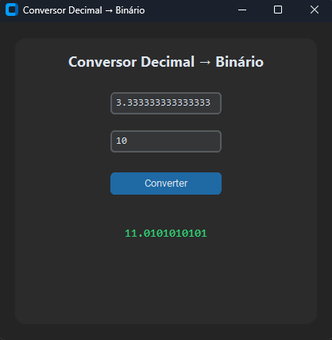

# 🔢 Conversor Decimal → Binário (GUI com CustomTkinter)

Uma aplicação simples e elegante desenvolvida em Python usando `customtkinter`, que converte números decimais (com parte fracionária ou não) para representação binária, com controle de precisão nas casas decimais.

---

## 📸 Preview
> 
---

## 🚀 Funcionalidades

- Converte números decimais **positivos ou negativos** para binário.
- Suporta **parte fracionária**, com precisão configurável.
- Interface gráfica moderna com `customtkinter`.
- Mensagens de erro amigáveis para entradas inválidas.

---

## 🧠 Exemplo de uso

| Entrada decimal | Precisão | Saída binária  |
|-----------------|----------|----------------|
| `10`            | `0`      | `1010`         |
| `5.75`          | `3`      | `101.11`       |
| `-2.5`          | `4`      | `-10.1`        |

---

## 💻 Requisitos

- Python 3.8 ou superior  
- [customtkinter](https://github.com/TomSchimansky/CustomTkinter)

---

## 📦 Instalação

```bash
# Clone o repositório
git clone https://github.com/seu-usuario/conversor-binario.git
cd conversor-binario

# Crie um ambiente virtual (opcional)
python -m venv venv
source venv/bin/activate  # ou venv\Scripts\activate no Windows

# Instale o customtkinter
pip install customtkinter
